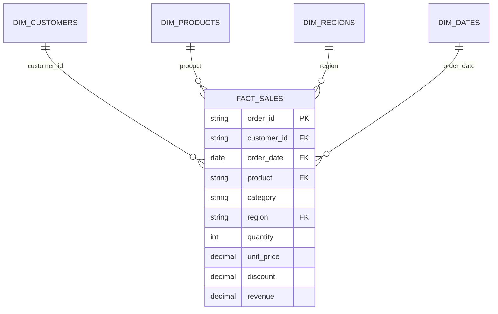

# E-Commerce Customer & Sales Analytics

A complete data analytics project analyzing transactional e-commerce sales across 8 repeat customers (48 validated orders, ₹14.4 Lakhs in revenue). 

This project covers the four core stages of a real analytics workflow:
1. **Excel** — Data cleaning (fixing negative & blank quantities, standardizing text casing), validation, and Pivot Tables.
2. **SQL** — Joining tables, aggregations, CTEs, and window functions (`LAG`, `DENSE_RANK`).
3. **Power BI** — Star Schema data modeling, DAX measures, and interactive dashboards.
4. **Business Analysis** — Finding actionable insights (customer spend concentration, category reliance, payment tracking).

---

## 📌 Project Overview

- **Total Sales**: ₹14,38,655 (~₹14.4 Lakhs)
- **Total Orders**: 48 Validated Orders (cleaned from 50 raw rows)
- **Average Order Value (AOV)**: ₹29,972 (~₹30,000)
- **Timeframe**: January 2026 – February 2026
- **Customers**: Aarav, Diya, Rohan, Meera, Kabir, Isha, Arjun, Sanya (100% Repeat Rate)
- **Categories**: Electronics, Furniture, Clothing
- **Regions**: North, South, East, West
- **Formula Used**: `Revenue = Quantity × Unit Price × (1 - Discount)`

---

## 🏗️ Data Model (Star Schema)

The dataset is organized into a central Fact table connected to four Dimension tables with 1-to-many relationships:



---

## 📂 Project Structure

```
Customer_Analytics/
├── data/
│   ├── raw/
│   │   └── raw_ecommerce_sales.csv        # Raw dataset with duplicates, blanks, and mixed dates
│   ├── processed/
│   │   ├── cleaned_ecommerce_sales.csv    # Cleaned dataset (10,441 rows)
│   │   ├── fact_sales.csv                 # Fact table
│   │   ├── dim_customers.csv              # Customer dimension table
│   │   ├── dim_products.csv               # Product dimension table
│   │   ├── dim_dates.csv                  # Calendar dimension table
│   │   └── dim_regions.csv                # Region dimension table
│   └── excel/
│       ├── ecommerce_analytics_model.xlsx # Excel model with formulas, lookups, and pivots
│       └── excel_data_cleaning_guide.md   # Step-by-step cleaning steps in Excel
├── sql/
│   ├── 00_master_interview_queries.sql    # Clean master SQL queries for interview prep
│   ├── 01_schema_setup.sql                # Table definitions and keys
│   ├── 02_data_cleaning_checks.sql        # Anomaly and duplicate checks
│   ├── 03_revenue_trends.sql              # Monthly sales and MoM growth (LAG)
│   ├── 04_customer_segmentation_rfm.sql   # Repeat buyers and customer tiers
│   ├── 05_product_performance.sql         # Best sellers and category breakdown
│   └── 06_regional_analysis.sql           # Sales and AOV by region
├── power_bi/
│   ├── data_model_star_schema.md          # Power BI model documentation
│   ├── dax_measures.md                    # Core DAX measures (Total Revenue, Orders, AOV, MoM%)
│   └── dashboard_layout_spec.md           # Dashboard wireframe and visual layout
├── web_dashboard/                         # Live interactive dashboard (Chart.js)
│   ├── index.html                         # Dashboard page
│   ├── styles.css                         # Clean modern styles
│   └── app.js                             # Interactive chart logic and filters
├── reports/
│   ├── business_insights_report.md        # Summary of business findings and recommendations
│   └── data_validation_report.md          # Audit log of data cleaning steps
└── portfolio/
    ├── resume_bullet_points.md            # Ready-to-use resume bullet points
    └── interview_talking_points.md        # Natural interview talking points and answers
```

---

## 🔍 Key Findings (In Plain English)

1. **Electronics drives 80% of company revenue**:  
   Electronics generated ₹11.59 Lakhs (80.6% of total sales), led by high-ticket items: Laptop (₹5.39L), Phone (₹3.33L), and Tablet (₹2.50L). Furniture accounted for 10.7% (₹1.54L) and Clothing for 8.7% (₹1.26L).

2. **Top 3 customers drive 78% of all sales**:  
   Our top 3 customers—Aarav (₹5.39 Lakhs), Isha (₹3.33 Lakhs), and Sanya (₹2.50 Lakhs)—generated ₹11.2 Lakhs combined. Aarav alone generated 37.5% of total revenue by purchasing Laptops in the North region.

3. **Regional revenue leadership**:  
   The North region generated the most revenue (₹6.23 Lakhs, 43.3% share), followed by the South (₹4.01 Lakhs, 27.8%), East (₹2.87 Lakhs, 19.9%), and West (₹1.28 Lakhs, 8.9%).

4. **Recoverable pending & failed payments**:  
   Tracking payment statuses revealed 2 Pending orders (₹35,100 total) and 1 Failed order (₹15,120), highlighting an immediate opportunity to recover over ₹50,000 in uncollected cash flow.

---

## 💻 Sample SQL Queries

### 1. Month-over-Month Revenue Growth (using `LAG`)
```sql
WITH monthly_sales AS (
    SELECT 
        d.year || '-' || printf('%02d', d.month) AS year_month,
        COUNT(DISTINCT f.order_id) AS orders,
        ROUND(SUM(f.revenue), 2) AS current_revenue
    FROM fact_sales f
    JOIN dim_dates d ON f.order_date = d.date_key
    GROUP BY year_month
)
SELECT 
    year_month,
    orders,
    current_revenue,
    LAG(current_revenue, 1) OVER (ORDER BY year_month) AS last_month_revenue,
    ROUND(
        (current_revenue - LAG(current_revenue, 1) OVER (ORDER BY year_month)) * 100.0 / 
        LAG(current_revenue, 1) OVER (ORDER BY year_month), 
        2
    ) AS mom_growth_pct
FROM monthly_sales;
```

### 2. Finding Loyal Repeat Customers (using `HAVING`)
```sql
SELECT 
    customer_id,
    COUNT(DISTINCT order_id) AS order_count,
    ROUND(SUM(revenue), 2) AS total_spent,
    ROUND(SUM(revenue) / COUNT(DISTINCT order_id), 2) AS avg_order_value
FROM fact_sales
GROUP BY customer_id
HAVING COUNT(DISTINCT order_id) >= 15 AND SUM(revenue) > 3000
ORDER BY total_spent DESC;
```

---

## 📊 Core Power BI DAX Measures

```dax
Total Revenue = SUM(fact_sales[revenue])

Total Orders = DISTINCTCOUNT(fact_sales[order_id])

Average Order Value = DIVIDE([Total Revenue], [Total Orders], 0)

MoM Growth % = 
VAR PriorRevenue = CALCULATE([Total Revenue], DATEADD(dim_dates[date_key], -1, MONTH))
RETURN
DIVIDE([Total Revenue] - PriorRevenue, PriorRevenue, 0)
```

---

## 🚀 How to View & Explore

1. **Excel Model**: Open [`data/excel/ecommerce_analytics_model.xlsx`](data/excel/ecommerce_analytics_model.xlsx) to see the cleaned data, Pivot Tables, and `XLOOKUP` formulas.
2. **SQL Queries**: Open [`sql/00_master_interview_queries.sql`](sql/00_master_interview_queries.sql) to review all query examples.
3. **Live Dashboard**: Run `python3 -m http.server 8085 --directory web_dashboard` and open `http://localhost:8085` in your browser.
4. **Interview Prep**: Read [`portfolio/interview_talking_points.md`](portfolio/interview_talking_points.md) for conversational, natural talking points for interviews.
