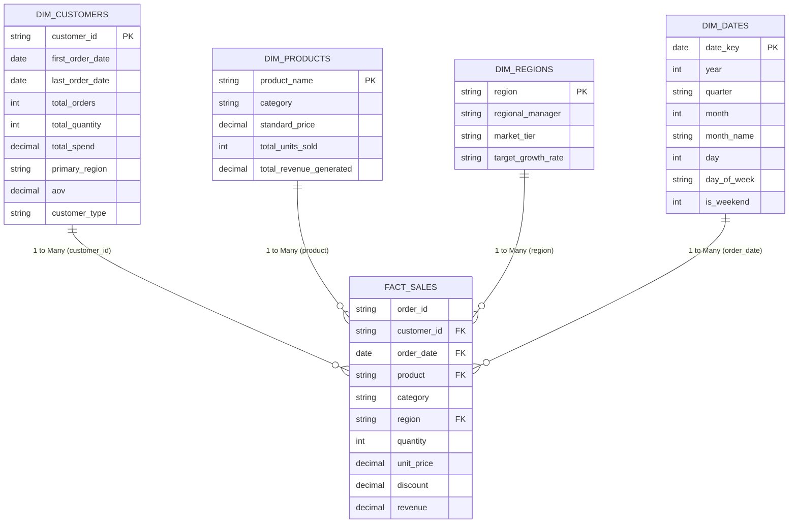

# Power BI Dimensional Data Model (Star Schema)

This document specifies the Star Schema data architecture implemented for the E-Commerce Sales & Customer Analytics solution in Microsoft Power BI.

---

## 1. Architectural Overview & Star Schema Diagram

The semantic model is optimized for high-performance in-memory VertiPaq tabular querying. The architecture consists of a single central transactional **Fact Table** surrounded by four dedicated **Dimension Tables**, enforcing a strict **1-to-Many (1:*)** unidirectional filtering relationship.

---

## 2. Table Relationships & Cardinality

| From Table (Primary Key) | To Table (Foreign Key) | Cardinality | Cross Filter Direction | Security Filtering |
| :--- | :--- | :--- | :--- | :--- |
| `dim_dates[date_key]` | `fact_sales[order_date]` | 1 to Many (1:*) | Single (Date filters Sales) | No |
| `dim_customers[customer_id]` | `fact_sales[customer_id]` | 1 to Many (1:*) | Single (Customer filters Sales) | No |
| `dim_products[product_name]` | `fact_sales[product]` | 1 to Many (1:*) | Single (Product filters Sales) | No |
| `dim_regions[region]` | `fact_sales[region]` | 1 to Many (1:*) | Single (Region filters Sales) | No |

---

## 3. Best Practices & Performance Optimization

1. **Unidirectional Filtering Only**:
   - Bi-directional cross-filtering is avoided to prevent ambiguous filter paths, performance degradation, and cartesian product inflation.
2. **Dedicated Date Table**:
   - `dim_dates` is flagged as an official Date Table in Power BI (`Mark as Date Table`), enabling native time-intelligence functions (`SAMEPERIODLASTYEAR`, `DATESYTD`, `DATEADD`).
3. **Surrogate Keys vs Natural Keys**:
   - Data types for foreign and primary keys are optimized as integer / clean strings with zero trailing whitespace.
4. **Calculated Columns vs DAX Measures**:
   - Business calculations are implemented strictly as dynamic **DAX Measures** rather than calculated columns in the fact table to minimize memory footprint and file size.
