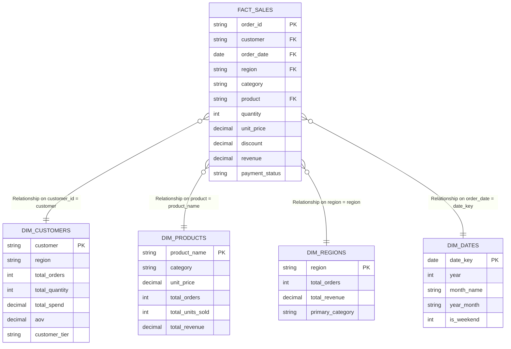

# Tableau Data Model & Relationships Architecture

This document specifies the data model architecture implemented for the **E-Commerce Sales & Customer Analytics** project in **Tableau Desktop / Tableau Public**.

---

## 1. Tableau Modern Data Model (Logical Layer Relationships)

Tableau's modern data model separates data modeling into two layers:
1. **Logical Layer (Relationships / "Noodles")**: Defines contextual relationships between tables without merging them into a single flat table prematurely. Aggregations occur dynamically at the native level of detail of each sheet.
2. **Physical Layer (Joins & Unions)**: Traditional database joins (`INNER`, `LEFT`, `RIGHT`) that physically combine rows before analysis.

For this project, we utilize the **Logical Layer (Relationships)** between the central fact table (`fact_sales`) and the four dimension tables.

---

## 2. Table Specifications & Cardinality

### Central Fact Table: `fact_sales.csv`
- **Granularity**: 1 record per order line transaction (48 validated records).
- **Core Measures**:
  - `Quantity` (Sum: 123 units)
  - `Unit_Price` (₹2,500 to ₹55,000)
  - `Discount` (0% to 20%)
  - `Revenue` (Sum: ₹14,38,655)
- **Foreign Keys**: `customer`, `product`, `region`, `order_date`.

### Dimension Tables (Contextual Attributes)
1. **`dim_customers.csv`** (8 unique customers)
   - Relationship: `fact_sales[customer] = dim_customers[customer]`
   - Cardinality: **Many-to-One (N:1)**
   - Role: Provides lifetime value attributes (`customer_tier`, overall AOV).

2. **`dim_products.csv`** (8 unique products)
   - Relationship: `fact_sales[product] = dim_products[product_name]`
   - Cardinality: **Many-to-One (N:1)**
   - Role: Categorizes items into Electronics, Furniture, and Clothing.

3. **`dim_regions.csv`** (4 sales territories)
   - Relationship: `fact_sales[region] = dim_regions[region]`
   - Cardinality: **Many-to-One (N:1)**
   - Role: Geographic analysis (North, South, East, West).

4. **`dim_dates.csv`** (Continuous calendar table)
   - Relationship: `fact_sales[order_date] = dim_dates[date_key]`
   - Cardinality: **Many-to-One (N:1)**
   - Role: Enables continuous time series and calendar-level drill-downs.

---

## 3. Why Tableau Relationships vs Traditional Joins?

When explaining this project in an interview, here is why Relationships ("Noodles") are superior to physical Joins:

1. **No Duplication of Fact Measures**:
   - If a customer table had multiple contact rows, a traditional SQL `LEFT JOIN` would duplicate transactional revenue amounts.
   - Tableau Relationships query each table independently at the native level of detail and perform a contextual outer join only when needed in the visualization.

2. **Smart Aggregation at Varying Levels**:
   - You can display total customer lifetime spend alongside individual order revenue without writing complex subqueries or `GROUP BY` logic.

3. **Performance Optimization (Culling)**:
   - Tableau utilizes "Join Culling": If a worksheet only uses fields from `fact_sales` and `dim_products`, Tableau will never generate SQL that references `dim_customers` or `dim_regions`.

---

## 4. How to Connect in Tableau Desktop / Tableau Public

1. Open Tableau Desktop / Public.
2. Select **Connect to a File** → **Text file**.
3. Choose `data/processed/fact_sales.csv`.
4. Drag `dim_customers.csv` into the canvas pane:
   - Set relationship clause: `customer = customer`.
5. Drag `dim_products.csv` into the canvas:
   - Set relationship clause: `product = product_name`.
6. Drag `dim_regions.csv` into the canvas:
   - Set relationship clause: `region = region`.
7. Drag `dim_dates.csv` into the canvas:
   - Set relationship clause: `order_date = date_key`.
8. Check **Extract Data** for optimal query speed.
